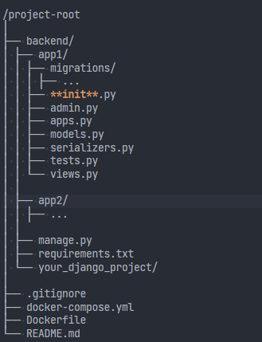

# Project Name

## Overview

This project serves as a template for building Python applications using Django Rest Framework, Docker, Docker Compose, and PostgreSQL. It provides a robust starting point for developing RESTful APIs with Django, utilizing the power of containerization for ease of deployment and management.

## Technologies Used

- [Django](https://www.djangoproject.com/): A high-level Python web framework that encourages rapid development and clean, pragmatic design.
- [Django Rest Framework](https://www.django-rest-framework.org/): A powerful and flexible toolkit for building Web APIs in Django.
- [Docker](https://www.docker.com/): A platform for developing, shipping, and running applications in containers.
- Docker Compose: A tool for defining and running multi-container Docker applications.
- [PostgreSQL](https://www.postgresql.org/): An open-source relational database management system.

## Project Structure

/project-root
│
├── backend/
│ ├── app1/
│ │ ├── migrations/
│ │ │ ├── ...
│ │ ├── **init**.py
│ │ ├── admin.py
│ │ ├── apps.py
│ │ ├── models.py
│ │ ├── serializers.py
│ │ ├── tests.py
│ │ └── views.py
│ │
│ ├── app2/
│ │ ├── ...
│ │
│ ├── manage.py
│ ├── requirements.txt
│ └── your_django_project/
│
├── .gitignore
├── docker-compose.yml
├── Dockerfile
└── README.md

#

Project Name

## Overview

This project serves as a template for building Python applications using Django Rest Framework, Docker, Docker Compose, and PostgreSQL. It provides a robust starting point for developing RESTful APIs with Django, utilizing the power of containerization for ease of deployment and management.

## Technologies Used

- [Django](https://www.djangoproject.com/): A high-level Python web framework that encourages rapid development and clean, pragmatic design.
- [Django Rest Framework](https://www.django-rest-framework.org/): A powerful and flexible toolkit for building Web APIs in Django.
- [Docker](https://www.docker.com/): A platform for developing, shipping, and running applications in containers.
- Docker Compose: A tool for defining and running multi-container Docker applications.
- [PostgreSQL](https://www.postgresql.org/): An open-source relational database management system.

## Project Structure

## Getting Started

### Prerequisites

- Docker
- Docker Compose
- [Python](https://www.python.org/) (for local development)

### Setup Instructions

1.  **Clone the Repository**
    git clone https://github.com/your-username/your-repository.git
    cd your-repository
2.  **Run the Docker Containers**
    docker-compose up --build -d

3.  **Access the Django Admin Panel**

    - Django Admin: http://localhost:8000/admin/
    - PgAdmin: http://localhost:80/

4.  **Start Developing!**

    Your Django application is now running at http://localhost:8000/.

## Project Customization

### Django Development

1.  **Run Migrations**

    `docker-compose exec server python manage.py migrate`

2.  **Create Superuser**

    `docker-compose exec server python manage.py createsuperuser`

Follow the prompts to create a superuser for accessing the Django Admin.

3.  **Access Django Shell**

    `docker-compose exec server python manage.py shell`

1.  You can now interact with your Django models through the shell.

### Database Management

- PostgreSQL Database is available at `localhost:5432`.
- PgAdmin is accessible at http://localhost:80/.

### Docker Commands

- **Start Containers**

  `docker-compose up -d`

- **Stop Containers**

  `docker-compose down`

## Notes

- Update the Django application code inside the `backend` directory.
- Customize the Dockerfile and docker-compose.yml as per project requirements.
- Ensure to modify sensitive information such as secret keys and passwords.

## License

This project is licensed under the [MIT License](https://chat.openai.com/c/LICENSE.md). Feel free to use it as a starting point for your projects!

Happy Coding! 🚀
